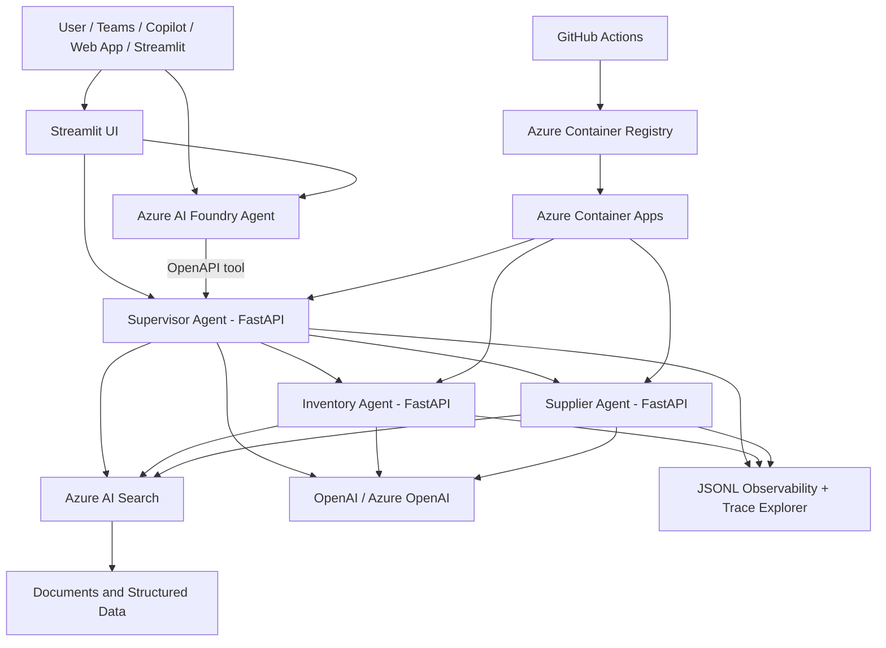

# Enterprise AI Agent Platform

Production-style multi-agent platform for a supply-chain copilot, built with **FastAPI**, **Azure Container Apps**, **Azure AI Foundry**, **Azure AI Search**, **RAG**, contextual memory, observability and CI/CD.


---

## What this project demonstrates

This repository is a reference implementation of an enterprise AI agent architecture:

- A **Supervisor Agent** routes user questions to specialist agents.
- **Inventory** and **Supplier** agents expose structured business capabilities through REST/OpenAPI.
- **Azure AI Search** stores structured supply-chain entities and document chunks.
- **RAG** answers policy and contract questions with source citations.
- **Contextual memory** keeps session context, so follow-up questions such as “Qual é o risco dele?” can resolve the prior supplier.
- **Trace IDs and observability** reconstruct the complete multi-agent execution flow.
- **Streamlit** provides a demo frontend and observability dashboard.
- **Azure AI Foundry** can act as the enterprise-facing agent layer through OpenAPI tools.
- **GitHub Actions** runs tests and deploys agents to Azure Container Apps.

---

## High-level architecture



In production, the UI can be replaced by **Microsoft Teams**, **Microsoft 365 Copilot**, Copilot Studio or an internal web app. The backend agents can remain unchanged because Azure AI Foundry communicates with them through OpenAPI tools.

---

## Main capabilities

| Area | Capability |
|---|---|
| Multi-agent architecture | Supervisor, Inventory Agent and Supplier Agent |
| Enterprise integration | FastAPI endpoints, OpenAPI schemas and Azure Container Apps |
| Azure AI Foundry | Foundry Supervisor Agent profile with OpenAPI tool integration |
| Retrieval | Azure AI Search for structured entities and document chunks |
| RAG | Document retrieval + LLM generation + source citations |
| Memory | Session-based contextual memory and conversation audit endpoints |
| Observability | Trace IDs, JSONL events, `/metrics`, `/traces`, `/traces/{trace_id}` |
| Frontend | Streamlit chat and Observability / Trace Explorer page |
| CI/CD | GitHub Actions tests, ACR build and Container Apps deploy |
| Testing | Pytest suite for agents, memory, OpenAPI endpoints and traces |

---

## Repository structure

```text
apps/
  inventory_agent/      Inventory specialist service
  supplier_agent/       Supplier specialist service
  supervisor/           Multi-agent supervisor service
  streamlit_ui/         Demo UI and observability dashboard
shared/                 Shared config, LLM, memory, Azure Search and observability code
openapi/                OpenAPI tool schemas for Azure AI Foundry
scripts/                Foundry agent creation, Azure Search bootstrap and document ingestion
data/                  Seed data and sample documents
logs/                  Local runtime logs, ignored by git
docs/                  Architecture, deployment, observability and release docs
tests/                 Automated tests
.github/workflows/     CI/CD pipelines
```

---

## Local setup

```powershell
python -m venv .venv
.\.venv\Scripts\activate
python -m pip install --upgrade pip
pip install -r requirements.txt
copy .env.example .env
notepad .env
```

Minimum `.env` for OpenAI:

```env
LLM_PROVIDER=openai
OPENAI_API_KEY=your_key_here
OPENAI_CHAT_MODEL=gpt-4o
OPENAI_EMBEDDING_MODEL=text-embedding-3-small
MODEL_TEMPERATURE=0.0
REQUEST_TIMEOUT=60
```

Optional Azure AI Search settings:

```env
AZURE_SEARCH_ENDPOINT=https://your-search-service.search.windows.net
AZURE_SEARCH_ADMIN_KEY=your_admin_key
AZURE_SEARCH_INDEX_NAME=supply-chain-docs
```

Optional Azure AI Foundry settings:

```env
AZURE_AI_PROJECT_ENDPOINT=https://your-foundry-resource.services.ai.azure.com/api/projects/your-project
FOUNDRY_AGENT_KEY=supervisor_agent
FOUNDRY_AGENT_ID=asst_your_agent_id
FOUNDRY_AGENT_DEPLOYMENT_FILE=deployment/foundry_agents.json
```

Never commit `.env`, API keys, local databases or logs.

---

## Run locally

Open three terminals.

Inventory Agent:

```powershell
uvicorn apps.inventory_agent.main:app --reload --port 8001
```

Supplier Agent:

```powershell
uvicorn apps.supplier_agent.main:app --reload --port 8002
```

Supervisor Agent:

```powershell
uvicorn apps.supervisor.main:app --reload --port 8000
```

Streamlit UI:

```powershell
streamlit run apps/streamlit_ui/app.py
```

Swagger UIs:

```text
http://localhost:8000/docs
http://localhost:8001/docs
http://localhost:8002/docs
```

---

## Bootstrap Azure AI Search

Create structured supply-chain documents:

```powershell
python scripts/bootstrap_azure_search.py
```

Ingest document chunks for RAG:

```powershell
python scripts/ingest_knowledge_documents.py
```

Check data source status:

```powershell
curl.exe http://localhost:8001/data-source-status
curl.exe http://localhost:8002/data-source-status
```

---

## Example tests

Structured question:

```powershell
$body = @{ question = "Quem fornece o PARAFUSO-M20?"; session_id = "demo-001" } | ConvertTo-Json
Invoke-RestMethod -Uri "http://localhost:8000/copilot" -Method POST -ContentType "application/json; charset=utf-8" -Body $body
```

Contextual follow-up:

```powershell
$body = @{ question = "Qual é o risco dele?"; session_id = "demo-001" } | ConvertTo-Json
Invoke-RestMethod -Uri "http://localhost:8000/copilot" -Method POST -ContentType "application/json; charset=utf-8" -Body $body
```

RAG with sources:

```powershell
$body = @{ question = "O que a política diz sobre estoque crítico?"; session_id = "demo-rag-001" } | ConvertTo-Json
Invoke-RestMethod -Uri "http://localhost:8000/copilot" -Method POST -ContentType "application/json; charset=utf-8" -Body $body
```

Trace inspection:

```powershell
Invoke-RestMethod -Uri "http://localhost:8000/traces" -Method GET
Invoke-RestMethod -Uri "http://localhost:8000/traces/<TRACE_ID>" -Method GET
```

---

## Automated tests

```powershell
$env:PYTHONPATH = (Get-Location).Path
pytest -q
```

The current suite validates health endpoints, memory, contextual follow-ups, OpenAPI tool endpoints, supplier endpoints and trace reconstruction.

---

## Azure deployment

The repository includes GitHub Actions workflows for:

- running tests on push and pull request;
- building images in Azure Container Registry;
- deploying Inventory, Supplier and Supervisor agents to Azure Container Apps.

Required GitHub secret:

```text
AZURE_CREDENTIALS
```

Runtime secrets such as `OPENAI_API_KEY` and `AZURE_SEARCH_ADMIN_KEY` should be configured as Container Apps secrets or through a future Key Vault / Managed Identity integration.

---

## Documentation

- [`docs/ARCHITECTURE.md`](docs/ARCHITECTURE.md) — architecture and request flows.
- [`docs/AZURE_AI_SEARCH.md`](docs/AZURE_AI_SEARCH.md) — structured retrieval and document RAG.
- [`docs/OBSERVABILITY.md`](docs/OBSERVABILITY.md) — metrics, traces and Trace Explorer.
- [`docs/PRODUCTION_READINESS.md`](docs/PRODUCTION_READINESS.md) — v1.0 status and v2 production roadmap.
- [`docs/RELEASE_CHECKLIST.md`](docs/RELEASE_CHECKLIST.md) — final release checklist.
- [`RELEASE_NOTES_V1.md`](RELEASE_NOTES_V1.md) — v1.0 release notes.

---

## v1.0 scope

This version is a stable reference platform for a multi-agent supply-chain copilot:

- Supervisor + specialist agents.
- Azure AI Search structured data and document RAG.
- Contextual memory and conversation audit.
- Trace-based observability and Streamlit Trace Explorer.
- CI/CD and Azure Container Apps deployment.

Recommended v2 improvements:

- Application Insights / OpenTelemetry export.
- Redis cache and distributed memory.
- Microsoft Entra ID authentication and RBAC.
- Key Vault and Managed Identity.
- Automated Foundry evaluations.
- Teams / Microsoft 365 Copilot publication.
