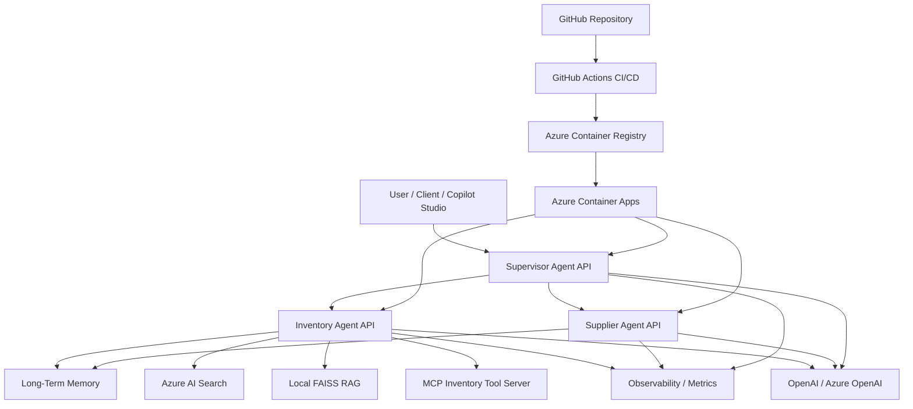

# Enterprise AI Agent Platform

Enterprise-grade multi-agent AI platform built with FastAPI, Azure Container Apps, Azure AI Search, OpenAI/Azure OpenAI, MCP and Retrieval-Augmented Generation (RAG).


---

## 🚀 Features

- Multi-Agent Architecture
- Long-Term Memory
- Retrieval-Augmented Generation (RAG)
- Azure AI Search Integration
- MCP (Model Context Protocol)
- Observability
- GitHub Actions CI/CD
- Dockerized Deployment
- Azure Container Apps
- OpenAI / Azure OpenAI Support

---

## 🛠 Tech Stack

- Python
- FastAPI
- Docker
- Azure Container Apps
- Azure Container Registry
- Azure AI Search
- OpenAI
- Azure OpenAI
- GitHub Actions
- FAISS
- MCP

# Multi-Agent Supply Chain Copilot

Reference architecture for an AI-powered supply chain copilot using **FastAPI**, **LangGraph**, **MCP**, **RAG**, **long-term memory**, **observability**, and **Azure Container Apps**.

This project demonstrates how to build and deploy a production-style multi-agent system that can run locally, inside containers, or in Azure.

## What this project demonstrates

- Multi-agent orchestration with a Supervisor Agent
- Specialist agents exposed as FastAPI services
- Inventory Agent with RAG, MCP tools, long-term memory, and observability
- Supplier Agent as a second specialist service
- OpenAI and Azure OpenAI provider abstraction
- Local execution with Uvicorn
- Cloud deployment with Azure Container Registry and Azure Container Apps
- Structured logs, metrics endpoints, and trace IDs
- Evaluation-ready project structure

## High-level architecture



Shared layer:

- LLM provider abstraction: OpenAI / Azure OpenAI
- Config management
- Schemas
- Cache
- Observability

See [`docs/ARCHITECTURE.md`](docs/ARCHITECTURE.md) for a more complete diagram.
```

See [`docs/ARCHITECTURE.md`](docs/ARCHITECTURE.md) for a more complete diagram.

## Main components

| Component | Responsibility |
|---|---|
| `apps/supervisor` | Routes user requests to the right specialist agent and validates responses. |
| `apps/inventory_agent` | Handles inventory questions, RAG, memory, MCP tools, and operational recommendations. |
| `apps/supplier_agent` | Handles supplier-related questions and supplier memory. |
| `mcp_servers/inventory` | MCP stdio server with inventory-specific tools. |
| `shared/llm.py` | Central provider factory for OpenAI and Azure OpenAI. |
| `shared/memory.py` | Long-term memory persistence and search. |
| `shared/azure_search.py` | Optional Azure AI Search integration. |
| `evaluation/` | Evaluation datasets and scripts. |

## Local setup

```cmd
python -m venv .venv
.venv\Scripts\activate
python -m pip install --upgrade pip
pip install -r requirements.txt
copy .env.example .env
notepad .env
```

Fill in your `.env` file. For OpenAI:

```env
LLM_PROVIDER=openai
OPENAI_API_KEY=your_key_here
OPENAI_CHAT_MODEL=gpt-4o
OPENAI_EMBEDDING_MODEL=text-embedding-3-small
```

For Azure OpenAI:

```env
LLM_PROVIDER=azure_openai
AZURE_OPENAI_ENDPOINT=https://your-resource.openai.azure.com/
AZURE_OPENAI_API_KEY=your_key_here
AZURE_OPENAI_CHAT_DEPLOYMENT=your-chat-deployment
AZURE_OPENAI_EMBEDDING_DEPLOYMENT=your-embedding-deployment
AZURE_OPENAI_API_VERSION=2024-12-01-preview
```

Never commit `.env` to GitHub.

## Run locally

Terminal 1 — Inventory Agent:

```cmd
uvicorn apps.inventory_agent.main:app --reload --port 8001
```

Terminal 2 — Supplier Agent:

```cmd
uvicorn apps.supplier_agent.main:app --reload --port 8002
```

Terminal 3 — Supervisor Agent:

```cmd
uvicorn apps.supervisor.main:app --reload --port 8000
```

Open the Swagger UIs:

```text
http://localhost:8001/docs
http://localhost:8002/docs
http://localhost:8000/docs
```

## Test the Inventory Agent locally

POST to `http://localhost:8001/invoke`:

```json
{
  "operation": {},
  "messages": [
    {
      "type": "human",
      "content": "Registre que o fornecedor do PARAFUSO-M20 é XYZ Metais."
    }
  ],
  "trace_id": "local-memory-001"
}
```

Then ask:

```json
{
  "operation": {},
  "messages": [
    {
      "type": "human",
      "content": "Qual o fornecedor do PARAFUSO-M20?"
    }
  ],
  "trace_id": "local-memory-002"
}
```

Expected response:

```text
O fornecedor do PARAFUSO-M20 é XYZ Metais. Esta informação está registrada na memória de longo prazo.
```


## Automated tests

Run the first automated quality gate with:

```cmd
pytest -q
```

The current test suite validates long-term memory persistence, product-code extraction, Portuguese memory-save triggers, the Inventory Agent health endpoint, and an end-to-end `/invoke` memory save/retrieve flow using a deterministic LLM double. Functional LLM/RAG quality checks are handled by the evaluation scripts in `evaluation/`.

## GitHub release guide

See [`docs/GITHUB_RELEASE_GUIDE.md`](docs/GITHUB_RELEASE_GUIDE.md) for the final checklist before publishing the repository.

## Azure deployment

The project supports a no-Docker-local workflow using **Azure Container Registry Tasks**:

```powershell
az acr build `
  --registry registrodecontainercassiofrd `
  --image inventory-agent:v6-2 `
  --file Dockerfile.inventory `
  .
```

Then update the Container App:

```powershell
az containerapp update `
  --name inventory-agent `
  --resource-group grupoderecursos_cassiofrd `
  --image registrodecontainercassiofrd.azurecr.io/inventory-agent:v6-2
```

See [`docs/AZURE_DEPLOYMENT.md`](docs/AZURE_DEPLOYMENT.md) for the full deployment guide.

## API examples

See [`docs/API_EXAMPLES.md`](docs/API_EXAMPLES.md).

## OpenAPI tool endpoints for Azure AI Foundry

In addition to the conversational `/invoke` endpoint, the Inventory Agent exposes
simple REST endpoints designed for OpenAPI-based tool calling platforms such as
Azure AI Foundry and Copilot Studio.

Examples:

```text
GET /products/{code}
GET /inventory-policy/{code}
GET /suppliers/{supplier_name}/products
GET /purchasing-policy
```

These endpoints expose specific business capabilities with predictable request
and response schemas, while `/invoke` remains available for conversational
LangGraph-based agent interactions.


## Provider configuration

The project can switch between OpenAI and Azure OpenAI without changing application code:

```env
LLM_PROVIDER=openai
```

or:

```env
LLM_PROVIDER=azure_openai
```

See [`PROVIDER_CONFIGURATION.md`](PROVIDER_CONFIGURATION.md).

## Observability

Each request receives a `trace_id`. Events are logged to:

```text
logs/agent_events.jsonl
```

Metrics are available at:

```text
GET /metrics
```

Health check:

```text
GET /health
```

## Release status

Current release: **v1.0 / project version v6.2**

Validated capabilities:

- Local Inventory Agent startup with Uvicorn
- RAG over local FAISS index
- Long-term memory save and retrieval
- ACR image build without local Docker
- Azure Container Apps deployment
- Memory retrieval working in Azure Container Apps

## Roadmap

- Add automated pytest suite
- Add evaluation pipeline with response scoring
- Add Redis-backed memory
- Expand Azure AI Search retrieval
- Add Supervisor + Supplier deployment validation
- Continue Azure AI Foundry implementation and comparison
- Add CI/CD with GitHub Actions
