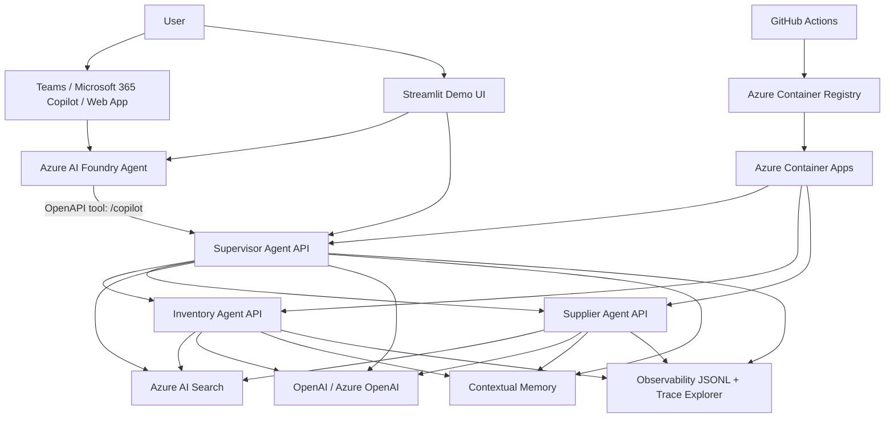
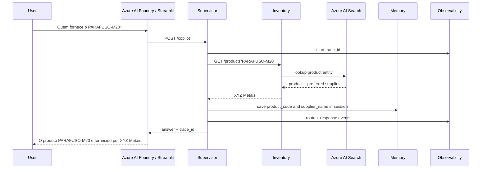
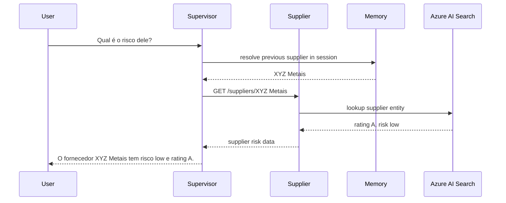
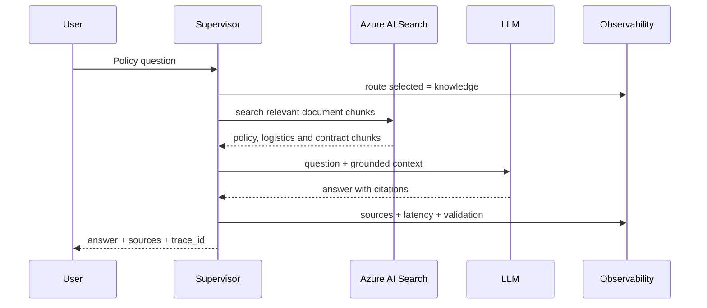
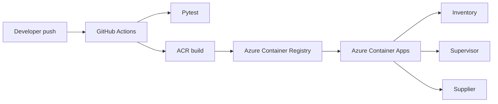

# Architecture

## Purpose

This project implements a production-style multi-agent supply-chain copilot. The platform separates the enterprise agent layer, orchestration layer, specialist services, retrieval layer and observability layer.

The design goal is low coupling:

- Azure AI Foundry can be the enterprise entry point.
- The Supervisor API owns business orchestration.
- Specialist agents expose stable REST/OpenAPI tools.
- Azure AI Search stores structured entities and document knowledge.
- Observability records the full execution flow with `trace_id`.

## High-level component diagram



## Runtime modes

### Local development

```text
Streamlit → Supervisor localhost:8000 → Inventory localhost:8001 / Supplier localhost:8002 → Azure AI Search / LLM
```

### Azure Container Apps

```text
Streamlit or Foundry → Supervisor Container App → Inventory/Supplier Container Apps → Azure AI Search / LLM
```

### Enterprise channel

```text
Teams / Copilot → Azure AI Foundry Agent → OpenAPI tool → Supervisor Container App → Specialist agents
```

## Request flow: structured question

Example: `Quem fornece o PARAFUSO-M20?`



## Request flow: contextual follow-up

Example after the previous question: `Qual é o risco dele?`



## Request flow: document RAG

Example: `O que a política diz sobre estoque crítico?`



## Deployment flow



## Design decisions

### Foundry as enterprise layer

Azure AI Foundry is used as the enterprise-facing agent layer. It can publish or expose agents to enterprise channels while calling backend services through OpenAPI tools.

### Supervisor as business orchestrator

The Supervisor API keeps the business routing logic in code, where it can be tested, versioned and observed. This avoids hard-coding all business orchestration inside the Foundry portal.

### Specialist agents as APIs

Inventory and Supplier are independent FastAPI services. They can be called by the Supervisor, Azure AI Foundry, Copilot Studio or any other API client.

### Azure AI Search as knowledge layer

The same Azure AI Search service supports:

- structured lookups for products, suppliers and policies;
- document retrieval for RAG.

### Observability-first execution

Every meaningful request produces a `trace_id`. The `/traces` and `/traces/{trace_id}` endpoints reconstruct execution from JSONL events, enabling debugging and audit.
