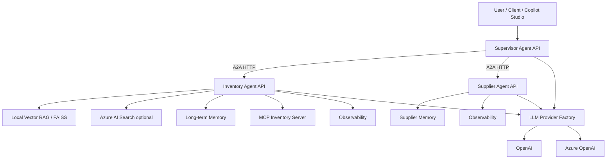
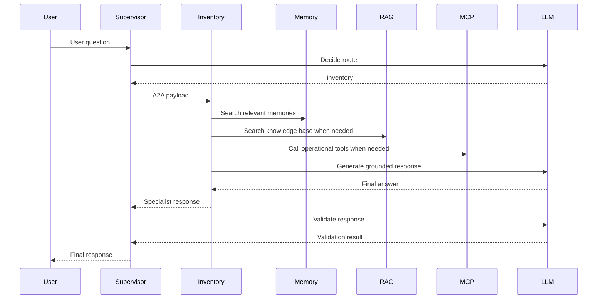

# Architecture

## Overview

This project is a multi-agent supply chain copilot. It uses a supervisor agent to route requests to specialist agents. Each specialist is exposed as a FastAPI service and can be deployed independently.

## Component diagram

## Request flow

## Key design decisions

### FastAPI per agent

Each agent is deployed as an independent HTTP API. This makes the architecture portable and easy to run locally or on Azure Container Apps.

### Uvicorn runtime

Uvicorn runs the FastAPI application and exposes the HTTP server. Locally, Uvicorn runs on the developer machine. In Azure, the container starts Uvicorn inside the image.

### Provider abstraction

The application code calls `get_chat_llm()` and `get_embeddings()`. The provider is selected through environment variables, allowing the same codebase to use OpenAI or Azure OpenAI.

### Memory before generation

The Inventory Agent retrieves long-term memories before generating a response. This makes saved user facts available as context and avoids relying only on tool-calling decisions.

### RAG and Azure AI Search

The project supports local FAISS retrieval and optional Azure AI Search. This enables local development while keeping a path to Azure-native retrieval.
